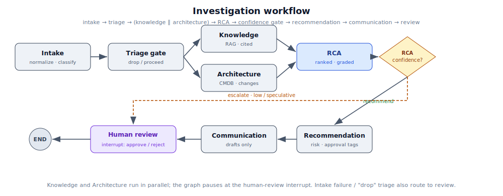

# Architecture & System Design — RCA & Incident Troubleshooting Platform

This is the consolidated system design for the platform (PoC). It folds the approved Phase 1–3
design into one reference. The locked PoC assumptions and deltas live alongside it in
`RCA-Platform-Architecture-Baseline-and-Deltas.md` (the ADR); per-component details are in the
`*-Implementation.md` docs and `Worked-Examples-Agent-Walkthrough.md`.

## 1. Purpose

Replace tribal-knowledge incident response with an AI system that **investigates** an incident and
produces a **root-cause analysis, ranked recommendations, and draft communications** — all for a
human to review and act on. It is a decision-support system, not an automation system.

## 2. Governing principle — safety by construction, not instruction

The platform is **advisory-only** and **read-only by construction**. It can investigate, correlate,
explain, recommend, and draft. It can **never** close an incident/CO/ECO, execute a remediation,
restart/deploy anything, acknowledge a page, or post to a channel. Its only writes are to **its own**
datastore: the RCA document, investigation state, and the audit log.

This is enforced architecturally, so a jailbroken or mistaken model still cannot act on production:

1. **Read-only credentials** — every external connector is configured with read-only tokens and a
   read-only cross-account AWS role (metadata/monitoring only, no data plane).
2. **GET-only connector clients** — the connector HTTP clients expose retrieval calls only; there is
   no code path that issues a mutating request.
3. **Tool registry assertion** — connectors register `ToolSpec`s; a structural test asserts
   `all(not spec.mutates ...)`, so a mutating tool can never be registered.
4. **Gateway allowlist** — agents reach the outside world only through the MCP gateway, which
   permits only allowlisted read-only tools (the gateway is the keystone still to be built).

The only human decision the platform records is at the **human-review interrupt** (approve / reject /
needs_changes). Acting on that decision still happens outside the platform, via the change/ECO
process, which remains the system of record.

## 3. System context

*If the image doesn't render in your viewer, open `docs/diagrams/system-architecture.svg` directly.*

## 4. Components

- **webhook-ingress** (`services/webhook_ingress/`) — verifies inbound provider webhooks
  (e.g. PagerDuty HMAC) and normalizes them into a provider-agnostic `NormalizedIncident`.
- **API** (`services/api/`) — FastAPI. OIDC/JWT auth, RBAC + ABAC, RFC 9457 problem+json errors,
  cursor pagination, SSE streaming. Creates incidents/investigations transactionally (with their
  audit row) and hands the workflow to the orchestrator. No endpoint mutates production.
- **Orchestrator** (`services/orchestrator/`) — builds and runs the LangGraph investigation graph,
  exposes start / get_status / resume_after_approval, and durably pauses at the human-review gate.
- **Agents** (`agents/`) — the six reasoning roles (§6). Each is dependency-inverted: the LLM client,
  MCP gateway, and audit sink are injected as Protocols; each degrades instead of crashing the graph.
- **MCP connectors** (`mcp_connectors/`) — read-only integrations to PagerDuty, ServiceNow, and
  Confluence (plus the PagerDuty inbound webhook verifier). Read-only at all four layers in §2.
- **MCP gateway** — the single read-only choke point the agents call tools through (allowlist +
  scope + audit). *Designed, not yet built — the keystone for an end-to-end run.*
- **libs** — `llm/` (the tiered Amazon Bedrock client; the only place model strings live; redaction
  baked in), `redaction/` (masks PII before any prompt; preserves operational signal), `audit/`
  (append-only hash-chain WORM sink).
- **db** (`db/`) — SQLAlchemy 2.0 async ORM, the async engine that sets per-request ABAC GUCs,
  repositories + a unit-of-work that makes each action atomic with its audit row, and migrations.

## 5. Data & persistence

PostgreSQL is the system of record for the platform's own state (not for incidents/changes — those
stay in ServiceNow/PagerDuty). Core tables: `incidents`, `investigations`, `approvals`, `feedback`,
`communications` (draft-only), and `audit_log`. Every business table carries a `team_id`.

- **ABAC via row-level security.** The engine sets `app.user_id`, `app.team_scope`, and
  `app.is_admin` as Postgres GUCs per request (via `set_config(..., local => true)`); RLS policies
  read those GUCs through an `app_in_team_scope()` helper, so a user only ever sees rows for their
  teams. Repositories also apply a team clause as defense-in-depth. Run the DB under a
  **non-superuser, non-BYPASSRLS** role so RLS is actually enforced.
- **WORM audit.** `audit_log` is append-only: a trigger blocks UPDATE/DELETE, and each row carries a
  hash chained to the previous row (`compute_entry_hash`, advisory-locked) so tampering is
  detectable. Actions and their audit rows are written in the same transaction.
- **Vector store.** For the PoC, embeddings live in **pgvector** in the same Postgres (OpenSearch is
  the production alternative). It backs the knowledge corpus for RAG.

## 6. The six agents

| # | Agent | Tier | Role | Reads | Writes (to its own state only) |
|---|---|---|---|---|---|
| 1 | Incident Intake | fast | Normalize + classify + severity floor + grounded initial hypothesis + triage clamp | incident, catalog | classification, affected_systems, hypothesis, triage |
| 2 | Knowledge Retrieval | mid | RAG over runbooks/Confluence/past RCAs; fully cited synthesis; surfaces conflicts | vector corpus, Confluence (RO) | summary, findings, citations, similar incidents, coverage |
| 3 | Architecture Discovery | — (deterministic) | Read CMDB/topology + recent changes; assemble dependency context | ServiceNow CMDB/changes (RO) | impacted CIs, dependencies, recent_changes |
| 4 | RCA | top | Correlate everything into ranked, evidence-referenced causes + alternatives + graded confidence | all of the above | rca (ranked causes, alternatives, overall confidence) |
| 5 | Recommendation | mid | Prioritized steps tagged with risk + approval requirement; never executes | rca, architecture, knowledge | recommendations (risk/approval-tagged steps) |
| 6 | Communication | mid | Draft Slack/work-note/exec-summary + the RCA report; draft-only | rca, recommendations | communications (status always "draft") |

Model **tiering** keeps the strongest (and most expensive) model on the hardest task (RCA) and
cheaper tiers on intake/synthesis/drafting. Tier→model mapping is the only place concrete model ids
exist (`libs/llm/config.py`), set via env.

## 7. Orchestration workflow

- Knowledge and Architecture run in parallel after triage and both feed RCA.
- The **confidence gate** routes low/speculative RCAs straight to human review, skipping automated
  recommendations.
- The graph is compiled with `interrupt_before=["human_review"]`, so it **durably pauses** for a
  human decision; the API's approval endpoint resumes it. The recorded decision gates whether the
  advisory output is released — it performs no production action.
- **Durability (R-1).** For production, the canonical executor is **Temporal**, with LangGraph
  confined to intra-investigation reasoning; the in-process compiled graph + a persistent
  checkpointer is the lighter PoC path and the unit of work Temporal would drive.

## 8. RAG design

A hybrid retrieve-then-rerank pipeline over the organizational corpus (runbooks, Confluence,
historical RCAs), plus an episodic store of confirmed past incidents. Grounding is mandatory:
Agent 2 may only assert what a retrieved, in-scope source supports, every finding carries ≥1
citation, and conflicts are surfaced rather than resolved away. Historical RCAs can be wrong (R-6),
so outcome/freshness metadata is authoritative and alternatives are always shown.

## 9. Security model

- **Identity** — enterprise SSO via OIDC; the API verifies RS256 JWTs against the IdP JWKS
  (issuer/audience checked). No platform-managed passwords.
- **Authorization** — **RBAC** roles `viewer | responder | approver | admin` gate endpoints
  (e.g. only `approver` can record an approval); **ABAC** multi-team isolation is enforced in the
  database via RLS (§5), not just in app code.
- **PII redaction (R-15)** — `libs/redaction` masks emails, IPs, keys/tokens, card/SSN/phone with
  consistent placeholders **before** any text reaches the model, while preserving operational signal
  (service names, error codes, git SHAs). Redaction is baked into the Bedrock client by construction.
- **Inference isolation (D-1)** — inference runs on **Amazon Bedrock in-account**; prompts/data are
  not used for training and do not leave the account for a third-party model API.
- **Account/network isolation (R-10)** — the platform runs in a **separate AWS account/region**;
  AWS access to observed systems is **read-only cross-account** (metadata/monitoring only).
- **Auditability** — append-only, hash-chained WORM audit of every agent output, tool call, and
  human decision.

## 10. AWS deployment topology (target)

A dedicated account/region; private VPC; the API/orchestrator as containers (ECS/EKS); Aurora
PostgreSQL (pgvector) in private subnets; Bedrock via VPC endpoint; secrets in AWS Secrets Manager /
SSM Parameter Store; AWS access to monitored accounts via a read-only assumed role. Prefer **IAM
roles** (IRSA on EKS, instance profile on EC2) over static AWS keys — the code already uses the
default boto3 credential chain, so no AWS keys belong in app config.

## 11. Risk register (summary)

R-1 durable orchestration (Temporal default). R-4 confidence is a grade, never a %. R-6 historical
RCAs can be wrong → freshness/outcome metadata + always show alternatives. R-9 prompt injection is a
first-class threat (untrusted-data framing in every prompt). R-10 separate account/region. R-11
prefer Bedrock. R-14 RCA needs observability evidence. R-15 PII → redaction. R-16 cross-team
retrieval isolation. R-17 automation bias → grades + alternatives + mandatory human review. R-18
availability circular-dependency (don't depend on the systems you diagnose). Full register and the
locked PoC deltas are in the ADR.

## 12. Current build status (accurate as of this revision)

**Implemented & statically validated** (compiles + import-graph resolves; unit suites run in CI):
all six agents and the full graph wiring (with the confidence gate); read-only PagerDuty/
ServiceNow/Confluence connectors; `libs/llm` (tiered Bedrock client, redaction baked in) and
`libs/redaction` (executed/verified); the FastAPI backend (OIDC, RBAC+ABAC, async SQLAlchemy +
unit-of-work, hash-chain audit); packaging, CI, and the initial DB migration.

**Not yet built (blocks an end-to-end QA run):** the **MCP gateway** (keystone); the **RAG retriever
+ ingestion** (Agent 2's corpus); a **read-only observability connector** (Agent 4's evidence
source); **infra** (container image, Helm/Terraform, provisioned Aurora/Redis); and **Bedrock +
connector credentials**. Nothing has executed yet — the first CI run is the first real test, and the
API's investigation endpoints return `503` until the orchestrator is constructed and injected.
