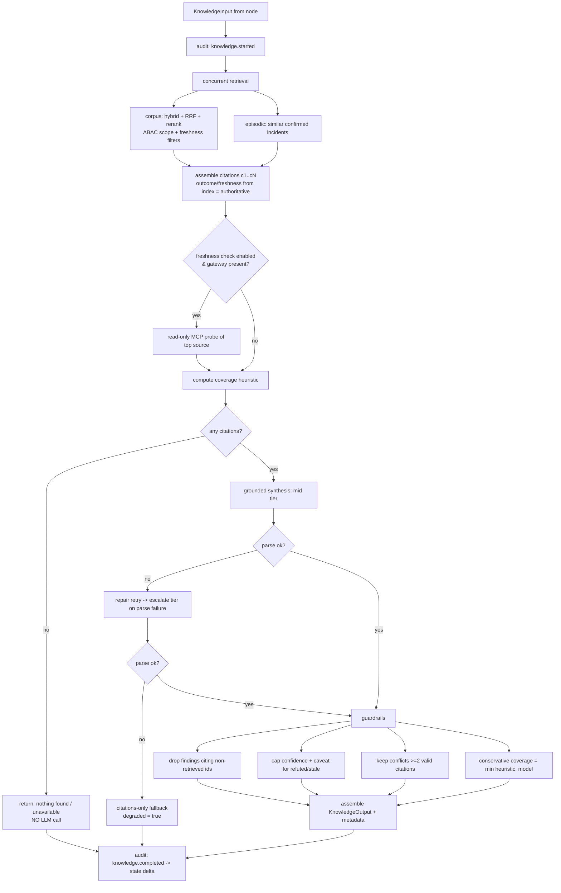

# Agent 2 — Knowledge Retrieval Agent
## Implementation Guide

**Status:** Implemented (Phase 4, second agent) · **Module:** `agents/knowledge_retrieval/` · **Node:** `services/orchestrator/graph/nodes/knowledge.py`

Agent 2 is the platform's RAG agent. After the triage gate, it runs **in parallel with Architecture Discovery (Agent 3)** and answers one question for the root-cause analyst: *what does the organization already know that is relevant to this incident?* It retrieves from the knowledge corpus (runbooks, Confluence, past RCAs, ServiceNow KB) and from **episodic memory** (similar past incidents whose outcomes were human-confirmed), then produces a neutral, **fully-cited** synthesis that surfaces conflicts and respects each source's outcome and freshness. It never decides the root cause and it never recommends an action.

> **Validation status:** all 21 Python files in the codebase pass `py_compile` on Python 3.12 and the cross-module import check. The Agent 2 unit tests are included and syntax-checked, **but not executed here** (pydantic v2 / pytest / pytest-asyncio aren't installed in this environment and the network is disabled). Run `pytest -q` where those deps exist.

---

## 1. Responsibilities

- **Retrieve** relevant knowledge via the internal RAG layer: hybrid (BM25 + dense) search with RRF fusion and cross-encoder reranking over the in-VPC vector store, plus episodic retrieval of similar confirmed incidents.
- **Cite everything.** Produce discrete findings, each grounded in one or more retrieved sources. A claim that cannot be cited is not emitted.
- **Surface conflicts.** When sources disagree — divergent remediation guidance, contradictory root causes, or a refuted analysis sitting next to a confirmed one — report it explicitly rather than silently picking a winner (Phase 1 R-6).
- **Respect outcome and freshness.** Treat `confirmed` / `refuted` / `unconfirmed` and current/stale as authoritative metadata from the index; never present a refuted source as fact; cap confidence and add caveats for refuted/stale sources.
- **Assess coverage.** Report a graded retrieval confidence and explicit gaps so downstream agents and the confidence-gate don't over-trust thin evidence.
- **Emit a full audit trail** (started / retrieved / completed / failed), logging document **ids and counts** — never document bodies.

Out of scope: root-cause reasoning (Agent 4), dependency topology (Agent 3), remediation (Agent 5), communication (Agent 6).

---

## 2. Workflow

---

## 3. LangGraph Node Design

`make_knowledge_node(agent) -> knowledge_node`, wired in `graph.py` as a parallel branch alongside `architecture_discovery` after the triage gate.

- **State → input (decoupled).** Rather than importing Agent 1's schema (the layering forbids agent→agent imports), the node reads *primitives* from state: `suggested_severity` from `classification`, the `name` of each entry in `affected_systems`, and the `statement` from `initial_hypothesis`. It tolerates missing pieces (falls back to the provider severity, then to `high`).
- **Output → delta.** Returns `output.model_dump(mode="json")` mapped onto the dedicated state keys: `knowledge_summary`, `knowledge_findings`, `citations`, `similar_incidents`, `knowledge_conflicts`, `knowledge_coverage`, `knowledge_metadata`, `knowledge_degraded`. These are disjoint from the Architecture Discovery node's keys, so the two parallel branches never collide on the blackboard.
- **Never crashes the graph.** Bad state or any agent exception returns `_degraded_delta(...)` — an empty, explicitly-degraded knowledge result plus an `errors` entry. Missing knowledge is survivable, so this does **not** force escalation; the RCA agent and the confidence-gate weigh low coverage themselves.

---

## 4. Prompts

`agents/knowledge_retrieval/prompts.py`, versioned `knowledge-v1`. Design decisions:

1. **Grounding-only.** The model may use *only* the provided sources; anything it can't cite goes under `gaps`, not into a finding.
2. **Cite by supplied ids.** Each retrieved source is labelled `[c1] … [cN]`; findings and conflicts must reference those exact ids. The agent then **re-validates** every id against the actually-retrieved set (see §9), so a fabricated citation can't survive.
3. **Untrusted source content.** Retrieved text lives inside a `=== RETRIEVED SOURCES ===` block; the system prompt forbids following any instruction found there.
4. **Outcome/freshness rules in the prompt, enforced in code.** The prompt tells the model to never present a refuted source as fact and to caveat stale/unconfirmed ones; the agent independently caps confidence for those sources regardless of what the model says.
5. **Strict single-object JSON** (`summary`, `findings[]`, `conflicts[]`, `retrieval_confidence`, `gaps[]`), parsed tolerantly with one repair retry.

Each source is rendered for the model as `[c1] type=runbook system=confluence outcome=confirmed currency=current` followed by title and excerpt — so outcome and freshness are visible at the point of citation.

---

## 5. MCP Calls

This is the key architectural difference from Agent 1, and it's deliberate:

**Agent 2 performs no MCP calls on its core path.** Retrieval is served by the **internal RAG layer** (`rag/retrieval/*`) over the in-VPC vector store. The knowledge corpus is built **offline** by the ingestion pipeline, whose connectors do the read-only pulls from Confluence/ServiceNow/etc. on a schedule — not at investigation time. Querying a vector index is internal infrastructure, not an external tool call, so routing it through the MCP gateway would be the wrong abstraction.

What the agent depends on instead:
- `RetrieverPort.search(...)` — hybrid retrieval + rerank over the corpus, with **ABAC scope and freshness pre-filters applied inside the retriever**.
- `RetrieverPort.search_episodic(...)` — similar past **confirmed** incidents.

**Optional, default-off freshness verification (the only MCP usage).** When `enable_freshness_check=True` *and* a gateway is injected, the agent issues a single **read-only** gateway call to confirm the top source is current. The allowlist is tiny and read-only:

| Tool (allowlisted) | Params | Purpose |
|---|---|---|
| `confluence.get_page` | `{"id": ...}` | Confirm a wiki source's currency. |
| `servicenow.get_knowledge` | `{"id": ...}` | Confirm a KB article's currency. |

It is best-effort: any failure is caught, recorded as a warning, and ignored. There is **no mutating tool** anywhere in the module.

---

## 6. Input Schema

`KnowledgeInput` (`agents/knowledge_retrieval/schemas.py`), built by the node.

| Field | Type | Notes |
|---|---|---|
| `investigation_id` | `UUID` | Correlation id. |
| `incident` | `NormalizedIncident` | The incident (contract). |
| `severity` | `SeverityLevel` | From intake's classification. |
| `affected_systems` | `list[str]` | System names from intake. |
| `initial_hypothesis` | `str?` | Intake's preliminary hypothesis, used as a query signal. |

---

## 7. Output Schema

`KnowledgeOutput` (`extra="forbid"`).

| Field | Type | Notes |
|---|---|---|
| `summary` | `str` | Neutral, cited overview (or a clear "nothing found / unavailable" message). |
| `findings` | `list[KnowledgeFinding]` | Each: `statement`, `citation_ids` (**`min_length=1`**), `confidence` (grade), `caveat?`. |
| `citations` | `list[Citation]` | Stable, reusable refs: `citation_id`, ids, source system/type, title, uri, snippet, `is_current`, `outcome`. |
| `similar_incidents` | `list[SimilarIncident]` | From episodic memory; `similarity` is a **grade**; carries confirmed root cause/resolution. |
| `conflicts` | `list[KnowledgeConflict]` | Each cites **≥2** sources; `kind` ∈ guidance/root_cause/outcome. |
| `coverage` | `KnowledgeCoverage` | `retrieval_confidence` (grade), counts, `has_runbook`, `has_confirmed_rca`, `stale_sources`, `gaps`. |
| `metadata` | `KnowledgeMetadata` | Model, prompt version, k's, counts, `expanded`, `freshness_checked`, tokens, `degraded`, warnings. |

The `citations` list is the contract the RCA and Communication agents reuse for end-to-end provenance.

---

## 8. Error Handling

Philosophy: **knowledge is survivable, so degrade — don't fail.** (`errors.py` + `agent.py` + node.)

| Failure | Where handled | Behavior |
|---|---|---|
| Bad input | `run()` / node | `run()` raises `KnowledgeInputError`; node returns a degraded delta. |
| Corpus retrieval fails | `_retrieve()` | Caught; `retrieval_failed=True`, warning; continue with whatever episodic returned. |
| Episodic retrieval fails | `_retrieve()` | Caught; warning; continue with corpus results. |
| No sources at all | `run()` | Return explicit "nothing found" (retriever worked) or "unavailable" (retriever failed). **LLM is not called.** |
| Synthesis call fails (transient) | `_call_llm()` | Retried up to `llm_max_attempts` per tier. |
| Synthesis unparseable | `_synthesize()` | Repair retry, then escalate one tier; if still unparseable → **citations-only** result, `degraded=True`. |
| Synthesis entirely unavailable | `_synthesize()` | Citations-only result (raw evidence preserved for the RCA agent), `degraded=True`. |
| Freshness probe fails | `_maybe_verify_freshness()` | Caught; warning; ignored. |
| Audit write fails | `_audit_event()` | Logged; never breaks the agent. |
| Unexpected exception | `run()` → node | Audited as `knowledge.failed`, re-raised; node degrades so the graph survives. |

The two-stage degradation matters: **retrieval is the core value; synthesis is an enhancement.** If the model is down but retrieval worked, the RCA agent still receives the cited sources.

---

## 9. Security Controls

| Control | Mechanism | Where |
|---|---|---|
| **Read-only by construction** | Retrieval is read-only over the vector store; the only MCP tools are read-only and optional; no mutating capability exists. | `tools.py`, `_interfaces.py` |
| **ABAC scope, never widened** | Every retrieval passes the investigation `scope`; the retriever filters by team/service/sensitivity inside, so out-of-scope knowledge is never returned (prevents cross-team leakage). | `agent.py`, `_interfaces.py` |
| **Anti-hallucination / grounding** | Findings with no citation are forbidden by the schema; the agent drops any finding whose cited ids aren't in the actually-retrieved set, and any conflict with <2 valid citations. The agent cannot assert anything not backed by a real retrieved document. | `agent.py::_apply_guardrails` |
| **Prompt-injection defense (corpus content, R-9)** | Retrieved text is fenced + "data only"; strict JSON output; citation re-validation limits blast radius; no tool the injected text could trigger. | `prompts.py`, `agent.py` |
| **Outcome/freshness integrity (R-6)** | Outcome + currency come from index metadata, not the model; refuted/stale sources cap a finding's confidence to ≤ low with a caveat; confirmed+refuted coexistence without a reported conflict raises a review warning. | `agent.py::_apply_guardrails`, `_build_citations` |
| **No over-reliance** | Conflicts are surfaced; coverage confidence is the **conservative minimum** of the heuristic and the model's self-assessment; gaps are explicit. | `agent.py` |
| **Bounded resource use** | Caps on k, context chunks, snippet size, tokens, timeouts, attempts, single escalation. | `config.py` |
| **Auditability without leakage** | Retrieval audited by **document ids + counts**, never bodies; model id/version + prompt version recorded. | `agent.py::_audit_event` |

---

## File manifest

| File | Role |
|---|---|
| `contracts/retrieval.py` | Retrieval DTOs/enums: `SourceType`, `DocumentOutcome`, `RetrievedChunk`, `EpisodicMatch`, `RetrievalFilters`. |
| `contracts/models.py` | *(extended)* added the Knowledge Retrieval output keys to `InvestigationState`. |
| `agents/knowledge_retrieval/schemas.py` | `KnowledgeInput`, `KnowledgeOutput` (+ sub-models), internal `_LLM*`. |
| `agents/knowledge_retrieval/config.py` | `KnowledgeConfig` — k's, caps, tiers, flags. |
| `agents/knowledge_retrieval/errors.py` | Typed errors (mostly degrade, don't raise). |
| `agents/knowledge_retrieval/_interfaces.py` | Protocols: LLM, audit, clock, `RetrieverPort`, optional gateway. |
| `agents/knowledge_retrieval/tools.py` | Read-only corpus/episodic search + optional freshness probe (allowlist). |
| `agents/knowledge_retrieval/prompts.py` | `knowledge-v1` grounded-synthesis prompt + builders. |
| `agents/knowledge_retrieval/agent.py` | `KnowledgeRetrievalAgent` — the implementation. |
| `services/orchestrator/graph/nodes/knowledge.py` | LangGraph parallel node wrapper. |
| `agents/knowledge_retrieval/tests/test_knowledge_agent.py` | Unit tests (fakes; grounding/conflict/degradation). |

## Dependencies & integration notes

- `RetrieverPort` is implemented by `rag/retrieval` (OpenSearch-primary or pgvector-MVP; the agent is store-agnostic). Embedding/reranker model choices remain an open decision and live in the RAG layer, not here.
- LLM tier→model mapping (mid = Sonnet-class, escalation = Opus-class) lives in `libs/llm`; **confirm exact model strings at build time**.
- Infra Protocols are re-declared in this module's `_interfaces.py` (canonical home: `libs/`); the same concrete clients satisfy both Agent 1's and Agent 2's Protocols structurally.
- `__init__.py` files omitted from this drop for brevity; add per the Phase 3 package convention.

*Awaiting approval before proceeding to Agent 3 (Architecture Discovery).*
